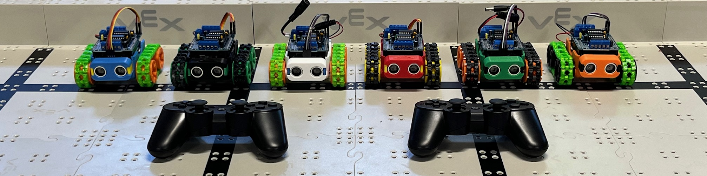

# phoenix_rovers_smars
SMARS code for Phoenix Rovers robotics team.

If you have a 3D printer and would like to build one at home, here is some information for you:

## 3D Printer Files
STL Files can be found here: https://www.thingiverse.com/thing:2662828

Parts to print:
 - (1) Chassis SL
 - (1) Holding Board 9V
 - (1) Ultrasonic 1
 - (1) Ultrasonic 2b
 - (2) Master Wheel
 - (2) Slave Wheel SL
 - (32) Mechanical Track (Flexible filament like TPU is best, if you have it)

## Electronic Parts
Links are for example, pricing may change and shopping around may be needed.  These particular links would provide enough parts for 3 robots.
 - Arduino Uno or [Wemos D1 R32 (recommended)](https://a.co/d/9RCvCmO) (3 for $19)
 - [Arduino Motor Shield v1 (L293D Shield)](https://a.co/d/5au71xM) (3 for $10)
 - (2) [N20 Motors 6v, Slow speed (~100rpm)](https://a.co/d/bgSqQUk) (6 for $20) (2 motors per robot)
 - [Ultrasonic Sensor HC-SR04](https://a.co/d/4brL1ym) (5 for $10)
 - [9V Battery Connector with male DC plug](https://a.co/d/7hTiKzK) (5 for $6)*
 - [Female DC pigtails](https://a.co/d/7v7frxh) (10 pairs for $10)*
 - [Female to Female Dupont Connectors](https://a.co/d/7Vdh4FO) (Assortment for $6)**

 *I have many 9V battery connectors and DC pigtails, and I am happy to provide them to our students. An alternative option, which involves soldering but results in a cleaner installation, is to take a 9V battery connector with bare wire leads, and insert a power switch on the positive wire.  The power switch can be mounted to the chassis and the wire leads can be directly connected to the Shield power inputs.  I can do this modification for our students as well, just let me know.
 
 **I have a large collection of Dupont ribbon cables and can make them custom length, so there's no reason to buy them for our students.  Just let me know if you need any.

## Bluetooth Controller (Optional)
The Wemos D1 R32 (ESP32) development board has a built-in bluetooth radio, which we can pair with pretty much any Bluetooth game controller.  An old PlayStation 3 controller is ideal, but should also work with Nintendo Switch, XBox, 8bitdo, and other controllers.  PS3 Clone controllers like [this one](https://a.co/d/9IKPwNE) also work fine.

It may also be possible to add a Bluetooth transceiver module to an Arduino, but this is beyond the scope of our effort.  If remote control is desired, my recommendation is to use a Wemos D1 R32 instead of an Arduino.

## Coding Setup
1. [Download](https://www.arduino.cc/en/software) and install Arduino IDE (recommend "MSI installer" version for Windows)
2. Click the "Code" dropdown button above, then click "Download ZIP".  Extract the folder "phoenix_rovers_smars" to your Arduino sketchbook folder (e.g. My Documents\Arduino). (Alternatively you can use Git to check out this repository, which makes it easy to keep it in sync if there are any changes.  This requires installing Git for your platform, and then using `git clone https://github.com/jdalbeck/phoenix_rovers_smars.git` from your git command line, within the Arduino sketchbook folder).
3. Download our [custom motor library](https://github.com/jdalbeck/Adafruit-Motor-Shield-library).  Click the "Code" dropdown button, then click "Download ZIP".  Extract the folder "Adafruit-Motor-Shield-library" to your Arduino IDE "libraries" folder. (Alternatively you can use Git to check out the repository to the "libraries" folder to make sure you can easily keep it in sync if there are any changes).
4. For the Wemos D1 board:
    1. [Follow these instructions](https://bluepad32.readthedocs.io/en/latest/plat_arduino/) under "Option A" to add ESP32 and Bluepad32 board packages to Board Manager and install ESP32 and Bluepad32 boards.
    2. When selecting a board target, use "WEMOS D1 R32" in the board dropdown list.